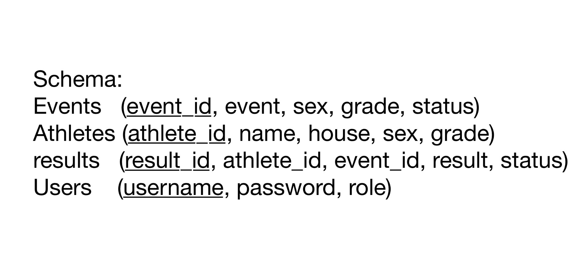

# Sports Day Management System
This is a web application for inputting, managing, reading and tracing sports day events, athletes and results. It is built by using Python with the flask and sqlite3 libraries 

## Features

### Authentication adn Data Security
- Two roles (Admin, User) with different permissions

| Feature | Admin | User |
|:-------:|:-----:|:----:|
| View Athletes | ✅ | ✅ |
| View Events | ✅ | ✅ |
| View Results | ✅ | ✅ |
| Manage Results | ✅ | ❌ |
| Manage Events | ✅ | ❌ |
| Filter Data | ✅ | ✅ |
- Password hashing with the library werkzeug.security, suggested by AI
- Protect routes with login requirements

### Athlete Management
- ID, name, house, gender and grade tracking
- Search by multiple criteria simultaneously
- Admin-only access to add/edit/delete athlete information
- Data validation for input is applied

### Event Management
- Grouped by ID, name, gender, grade
- Event status tracking
- Search by multiple criteria simultaneously

### Result System
- Real-time result tracking and ranking
- Automatic ranking calculation (time-based and distance-based events)
- Search by multiple criteria simultaneously
- Data validation for input is applied

### Mobile View
- Hamburger navigation menu for mobile devices
- Optimised layouts for phones

### Sample data generation
- Sample data is generated by faker and random libraries

## Database

### Schema


### ER Diagram


## Core Tables

### User Table
```sql
CREATE TABLE Users (
    username TEXT PRIMARY KEY,
    password TEXT NOT NULL,
    role TEXT NOT NULL CHECK(role IN('admin','user'))
);        
```

### Events Table
```sql
CREATE TABLE Events (
    event_id TEXT PRIMARY KEY,
    event TEXT NOT NULL,
    sex TEXT NOT NULL CHECK(sex IN('Boys','Girls')),
    grade TEXT NOT NULL CHECK(grade IN('A','B','C')),
    status TEXT NOT NULL CHECK(status IN('Completed', 'Not yet started'))
);    
```

### Athletes Table
```sql      
CREATE TABLE Athletes (
    athlete_id TEXT PRIMARY KEY,
    name TEXT NOT NULL,
    house TEXT NOT NULL,
    sex TEXT NOT NULL CHECK(sex IN('Boys','Girls')),
    grade TEXT NOT NULL CHECK(grade IN('A','B','C'))
);    
```

### Results Table
```sql
CREATE TABLE results (
    result_id INTEGER PRIMARY KEY AUTOINCREMENT,
    athlete_id TEXT NOT NULL REFERENCES Athletes(athlete_id),
    event_id TEXT NOT NULL REFERENCES Events(event_id),
    result REAL,
    status TEXT NOT NULL CHECK(status IN('Completed', 'Not yet started', 'Disqualified'))
);
```

## Database Features
- Foreign key constraints maintain data consisency for referential integrity
- CHECK constraints enforce valid values

## Algorithms
1. Ranking Algorithm
```python
def invalid_ranking(r):
    return (r['result'] is None) or (r['status'] in ('Disqualified', 'Not yet started'))
    # Separate valid and invalid results
        
is_time_based = 'meters' in row['event'].lower()
valid = [res for res in results['result'] if not invalid_ranking(res)]
invalid = [res for res in results['result'] if invalid_ranking(res)]

if is_time_based:
    sorted_results = sorted(valid_results, key=lambda r: r['result']) # Lower time is better
else:
    sorted_results = sorted(valid_results, key=lambda r: -r['result']) # Higher score is better

# Calculate ranks
current_rank = 1
for i, result in enumerate(sorted_results):
    if i > 0 and result['result'] == sorted_results[i-1]['result']:
        result['rank'] = current_rank  # Tie handling
    else:
        current_rank = i + 1
        result['rank'] = current_rank

```


### Key Features
- Automatically identify time-based events by checking for "meters" in event name
- Athletes with the same results share the same rank
- Disqualified or incomplete results are excluded from ranking

2. Data Grouping and Organization
```python
# Group results by event for display
grouped = {}
for row in all_rows:
    key = (row['event_id'], row['event'], f"{row['event_sex']} {row['event_grade']}")
    if key not in grouped:
        grouped[key] = {'event_status': row['event_status'], 'result': []}
```

## Database + Algorithm

1. Validation
```python

# Get required attributes from different tables 
athlete = db.execute(
    "SELECT * FROM Athletes WHERE athlete_id=?", (ath_id,)
).fetchone()
event = db.execute(
    "SELECT * FROM Events WHERE event_id=?", (ev_id,)
).fetchone()

# Validation
if not athlete:
    flash("Athlete ID not found", "error")
elif not event:
    flash("Event ID not found", "error")
elif athlete['sex'] != event['sex'] or athlete['grade'] != event['grade']:
    flash("Sex/grade mismatch between athlete & event", "error")
else:
    event_status = event['status']
    if event_status == 'Not yet started':
        flash("Cannot add result to an event that has not started", "error")
        return redirect(url_for('add_result'))
```

2. Multiple Criteria Filtering
```python
query = "SELECT * FROM Athletes"
where_filters = []
params = []

# Add conditions to where_filters
if athlete_id:
    where_filters.append("athlete_id=?")
    params.append(athlete_id)
if house:
    where_filters.append("house=?")
    params.append(house)
if sex:
    where_filters.append("sex=?")
    params.append(sex)
if grade:
    where_filters.append("grade=?")
    params.append(grade)

# Join all the conditions
if where_filters:
    query += " WHERE " + " AND ".join(where_filters)

# Get the data that fulfill all conditions 
athletes = db.execute(query, params).fetchall()
```

## Project Structure
```text
SBA/
├── app.py                 
├── fake_info.py           
├── requirements.txt       
├── sports_day.db     # auto-generated     
├── build/                 
│   ├── static/
│   │   ├── css/          
│   │   └── js/         
│   └── *.html            
└── README.md          
```

## Tools/Tutorial Used

- AI:
  1. Provide library recommendations (Faker for sample data, Werkzeug for security) and syntax guidance
  2. Generate CSS and JavaScript for the website, and add those styles into HTML files
  3. Debug and suggest errors that I have made
  4. Make Python code tidier
- Online HTML Beautifier: Make HTML code tidier
- [Github](github.com): Store codes
- [W3Schools](www.w3schools.com): Learn HTML
- [Flask Documentation](flask.palletsprojects.com/en/stable): Learn flask framework 


## Installation
1. Clone or download the project files
2. Set up Python virtual environment
3. Install dependencies from requirements.txt
   ```bash
   pip install -r requirements.txt
   python app.py
   ```
4. Default username and password:
   - **Admin**
     - Username: admin
     - Password: adminpass
     - Permissions: Full system access
   - **User**
     - Username: user
     - Password: userpass
     - Permissions: Read-only access
